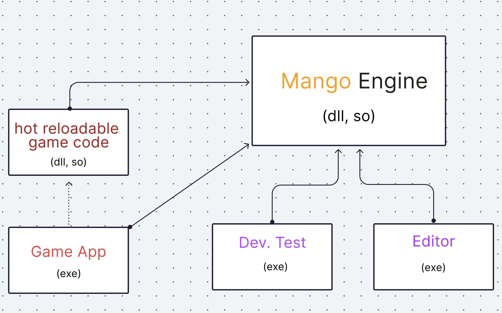
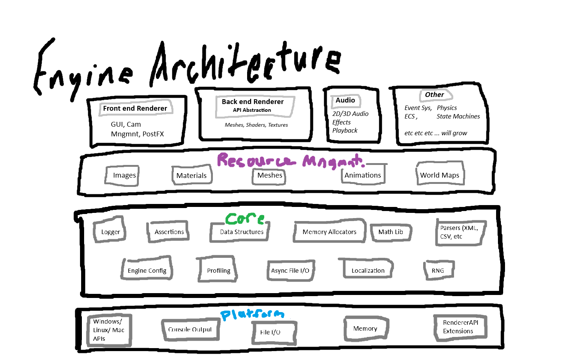
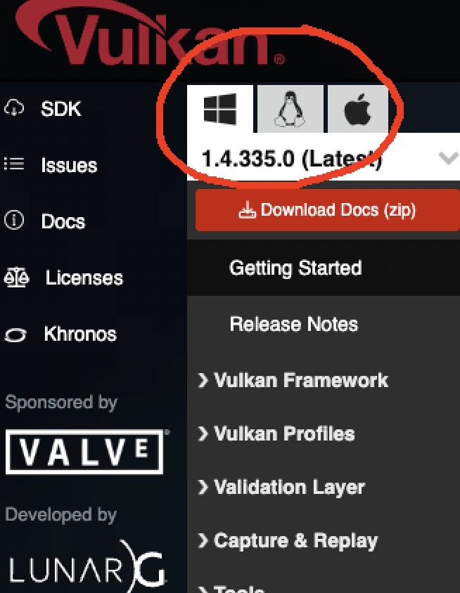
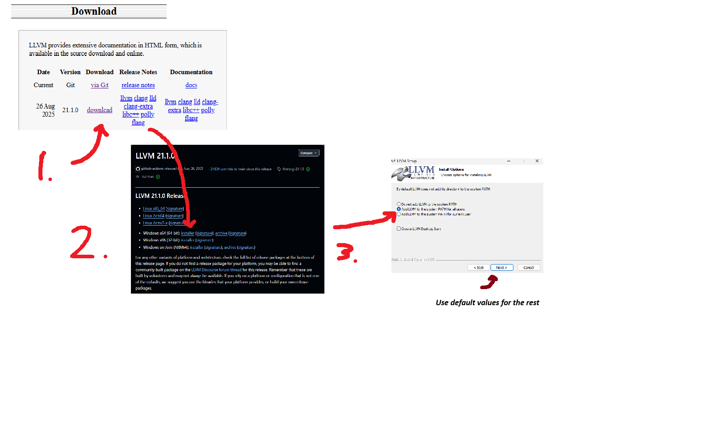

# Mango
Vulkan based Game Engine in C++

## Project Structure

* **MangoEngine (`DLL` / `.so`)**: The core shared library containing the renderer, ECS, and low-level systems.
* **Hot-Reloadable Game Code (`DLL` / `.so`)**: A lightweight module for gameplay logic. It can be recompiled and reloaded while the app is running for instant feedback.
* **Game App (`EXE`)**: The shipping client that hosts the engine and manages the lifecycle of the game logic.
* **Dev Test (`EXE`)**: An isolated sandbox for stress-testing engine features in isolation.
* **Editor (`EXE`)**: A separate application for world-building, kept out of the final shipping build.

## Features
* Lightweight build system - no cmake, avoiding complexities
* Low-level utilities - binary trees, helpers, etc
* Platform Layer (Windows and MacOS for now)
* Logger 
* File I/O
* Application Layer
* Renderer/API Abstraction Layer (Sits over Vulkan)
* allocators - ecs, mimalloc, etc
* scripting - hot reloading
* Physics 

## Engine Architecture

## Setup

### Install Vulkan, Clang

* **Vulkan SDK** - Download the installer for your specific operating system (Windows, macOS, or Linux) from the [Vulkan SDK Home Page](https://vulkan.lunarg.com/sdk/home). Then refer to your specific os for specific setup instructions regarding environent variables, dependencies, etc, if needed.

* **Clang++** - If your on MacOS, it will be installed with `xcode-select --install`, for windows follow these instructions, first navigate to [LLVM Releases Page](https://releases.llvm.org/). and select the most recent stable version
